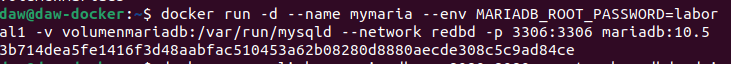

## Ejercicio 3 - Redes

> Tarea realizada por: Pelayo de la Fuente Díaz

1. Crea una red bridge `redbd`

`docker network create redbd`

2. Crea un contenedor con una imagen de `mariaDB` que estará en la red redbd. Este
contenedor se ejecutará en segundo plano, y será accesible a través del puerto 3306. (Es
necesario definir la contraseña del usuario root y un volumen de datos persistente)

`docker run -d --name mymaria --env MARIADB_ROOT_PASSWORD=laboral1 -v /opt/mysql_bd:/var/lib/mysqld --network redbd -p 3306:3306 mariadb:10.5`

3. Crear un contenedor con `Adminer` que se pueda conectar al contenedor de la BD

`docker run --link contenedor_bd:bd --network redbd -p 8080:8080 adminer`

4. Comprobar que el contenedor Adminer puede conectar con el contenedor mysql abriendo un navegador web y accediendo a la URL:

`http://localhost:8080`

-Pantallazos donde se vean los contenedores creados y en ejecución

-Pantallazo donde se vea el acceso a la BD a través de la interfaz web de Adminer

-Pantallazo donde se vea la creación de una BD con la interfaz web Adminer

-Pantallazo donde se entre a la consola del servidor web en modo texto y se compruebe que se ha creado la BD

`docker exec -it mymaria mariadb --user root -p`

`SHOW databases`

-Borrar los contenedores la red y los volúmenes utilizados

`docker rm -f nombre`

`docker network rm nombre`

`docker volume rm nombre`
