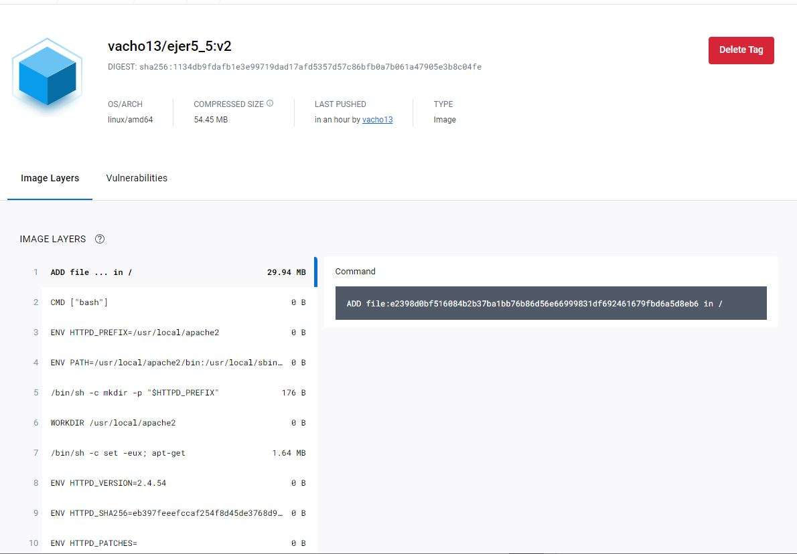

# Ejercicio5

1. Pantallazo/bloque de código con el Dockerfile

`nano dockerfile`

2. Pantallazo donde se vea el comando que crea la nueva imagen.

`docker build -t vacho13/ejer5_5:v2`

3. Pantallazo donde se vea la imagen subida a tu cuenta de Docker Hub.

4. Pantallazo donde se vea la bajada de la imagen por parte de otra persona del grupo y la creación de un contenedor.

5. Pantallazo donde se ve el acceso al navegador con el sitio servido

