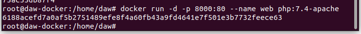
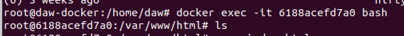
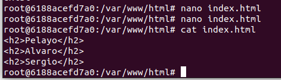
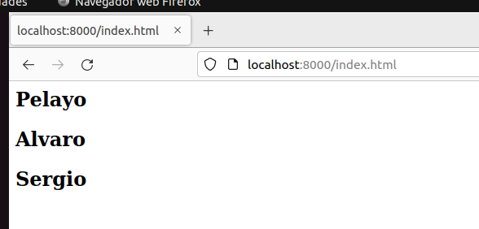
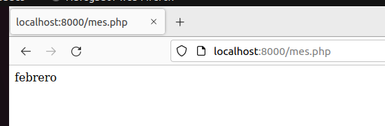
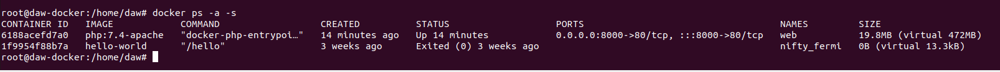
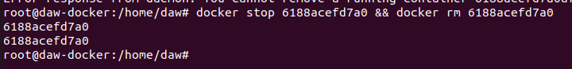
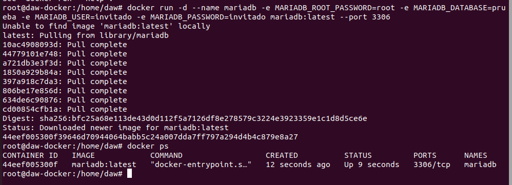
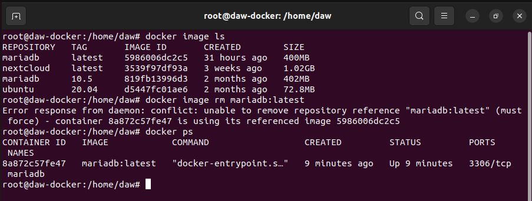

# Ejercicio 1

## Servidor Web

· Arranca un contenedor que ejecute una instancia de la imagen `php:7.4-apache` , que se llame `web` y que sea accesible desde un navegador en el puerto 8000. 

```bash
docker run -d -p 8000:80 --name web php:7.4-apache
```



· Colocar en el directorio raíz del servicio web ( `/var/www/html` ) un sitio web donde figure el nombre de los componentes del grupo 

```bash
docker exec -it 6188acefd7a0 bash
```



```bash
nano index.html
```



Resultado final:



· Colocar en ese mismo directorio raíz un archivo llamado mes.php que muestre el nombre del mes actual. Ver la salida del script en el navegador.

 

· Tamaño del contenedor



· Borrar el contenedor

```bash
docker stop 6188acefd7a0 && docker rm 6188acefd7a0
```




# Servidor de base de datos

· Arrancar un contenedor que se llame `bbdd` y que ejecute una instancia de la imagen **mariadb** para que sea accesible desde el puerto 3306.

Antes de arrancarlo visitar la página del contenedor en Docker Hub y establecer las variables de entorno necesarias para que: 

- La contraseña de root sea root . 
- Crear una base de datos automáticamente al arrancar que se llame prueba . 
- Crear el usuario invitado con la contraseña invitado .

```bash
docker run -d --name mariadb -e MARIADB_ROOT_PASSWORD=root -e MARIADB_DATABASE=prueba -e MARIADB_USER=invitado -e MARIADB_PASSWORD=invitado mariadb:latest --port 3306
```



Se comprueba que se puede conectar al servidor de la base de datos, y conectarnos con el usuario invitado. Realizamos el comando SHOW DATABASES; para poder ver las BBDD a las cuales tiene acceso el usuario.


Vemos que no podemos borrar la imagen de MariaDB ya que tenemos en ejecución el contenedor `bbdd`



Vemos que al realizar el comando `docker ps`, podemos ver el ID del contenedor y coincide con el indicado que da el error. 