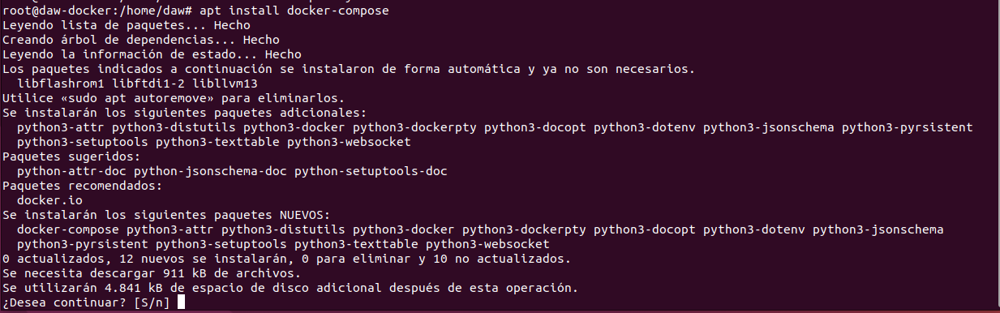
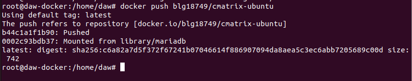
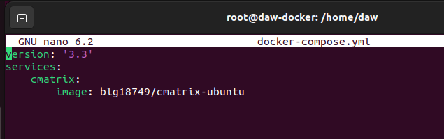
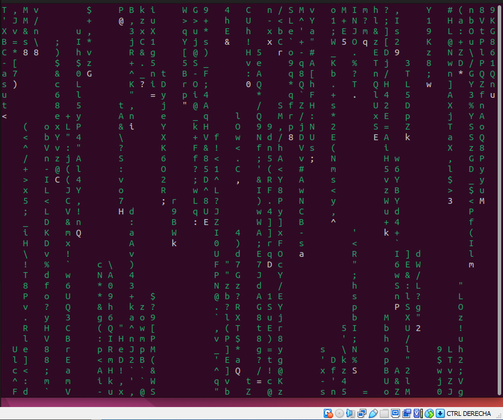
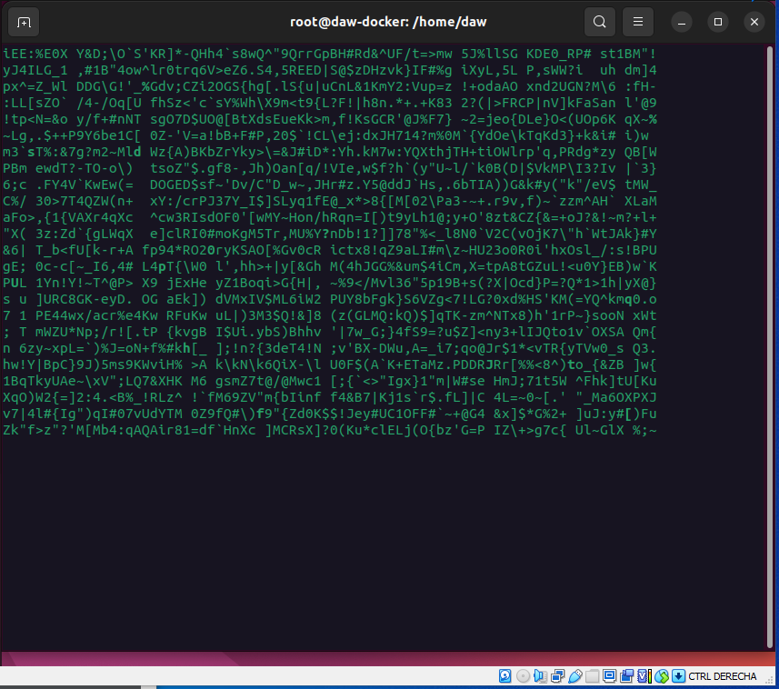

# Docker

Instalamos docker-compose para poder realizar dicha acción.

```bash
apt install docker-compose
```



Subimos la imagen a nuestro propio repositorio en [hub.docker.com]()



Estructura del documento docker-compose.yml



Ejecutamos el comando cmatrix (En mi caso, me funciono de dos maneras diferentes)

```bash
docker compose run cmatrix cmatrix
```

```bash
docker-compose run cmatrix cmatrix
```



Ejecutamos el comando greenrain

```bash
docker compose run cmatrix greenrain
```



Lo que hace, es simular el efecto Matrix en la terminal